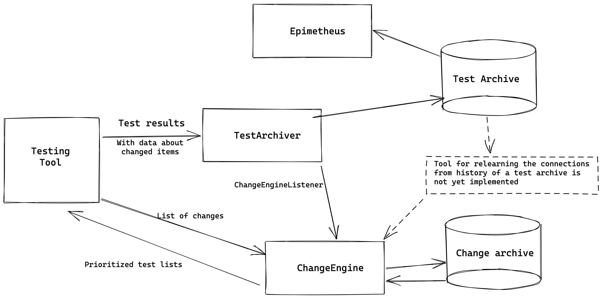

# ChangeEngine

ChangeEngine is a tool for prioritizing your test runs based on previous results. It works by learning which test cases are the most sensitive to changes that are made between test executions.

Test history is stored in database using [TestArchiver](https://github.com/salabs/TestArchiver).

And [Epimetheus](https://github.com/salabs/Epimetheus) is the tool for browsing the results you archived.

## Requirements

1) PostgreSQL database where to archive result data.
2) `Python v3+`

## Database

Currently the only supported database engine is PostgreSQL. It can be local or cloud version.

Note that database should be different from what TestArchiver uses to store test result history. Both databases can be located on the same database server.

### Database schema

As the project is still in its alpha state, database must be created manually. You can use for example [pgAdmin](https://www.pgadmin.org/) to create a new database and then use [schema.sql](schema.sql) as schema template.

## Server component

Server component connects to database and waits for information about file changes.

First we have to configure the server with json config file. Template config file looks like this:

    {
        "db_name": "database_name",  # Use a different one from TestArchiver
        "db_host": "database_host_url",
        "db_user": "database_username",
        "db_password": "database_password",
        "port": server_listen_port
    }

Running server is done by passing the config file as an argument to `server.py`. Example run:

    python ./server.py config.json

Server should be running in port specified in configuration file.

## Feeding data to ChangeEngine
ChangeEngine expects to be fed with test results along with lists of things (usually file names) that have changed since the previous time the result to the same test was inserted. The tool keeps track of the previous status of the test cases and if it has changed since the previous execution, the tool will update the sensitivity matrix with that knowledge.

ChangeEngine is only concerned about the current known state of the sensitivity matrix that it maintains on the changes and related test cases. On the other hand, TestArchiver and the archive database created by it is designed to hold the history of those changes. Should you need to recalibrate or update ChangeEngine, the ChangeEngine database can be dropped and the history of changes and results is designed to be reinserted from the test archive. Inserting data through TestArchiver is therefore recommended.

Additionally, the most important information to archive with your results is the exact version of the system under test. This could be for example the commit id or other version information of the system which can later be used to determine what had changed between the executions of tests.



An example work flow using TestArchiver and Robot Framework:

### Find out what has changed
First we need to get the the list of files that have changed. Due to the fuzzy nature of the algorithm you do not need to be too exact here. There are multiple approaches but here are a few examples using git:
```
git diff-tree --no-commit-id --name-only CURRENT_COMMIT..PREVIOUS_COMMIT
```
If working with feature branches you could do:
```
git diff-tree --no-commit-id --name-only HEAD..master
```
If doing local development, consider changes not yet committed:
```
git diff --name-only
```

If your project and changes are sufficiently small you can be more specific with the changes. By using the `diff2change_context_list.py` script that comes with TestArchiver you can also list the changes within each file.
```
git diff HEAD^1 | diff2change_context_list.py
```

### Run tests and add the changes as metadata
You can add the information about the changes to the test report:
```
robot --metadata changes:"$(YOUR_GIT_COMMAND_LISTING_RELEVANT_CHANGES)" --metadata commit:$(git rev-parse HEAD) tests/
```
You can also add the same metadata using `testarchiver --metadata` when archiving the results if you do not want to pollute your test reports with the metadata. TestArchivers ChangeEngineListener expects the changes to be listed in metadata item named `changes` separated by new lines.

### Archive the results and feeding ChangeEngine
Now simply tell the url where ChangeEngine is waiting for data to test archiver.
```
testarchiver --change-engine-url CHANGE_ENGINE_URL output.xml
```

### Prioritize test cases
Once data is inserted prioritizations can be queried from the ChangeEngine based on a list of new changes. If no changes are given the algorithm defaults to listing test cases based on their most recent failures.

With Robot framework you can use the `robot_prioritizer.py` script. When querying the test cases you should define the information the same way as when archiving results. So if you defined a repository for the tests add that.
```
YOUR_GIT_COMMAND_LISTING_RELEVANT_CHANGES | python3 robot_prioritizer.py --change_engine_url CHANGE_ENGINE_URL --stdin --remnant
```
This should produce two robot argument files: `prioritized.robot` listing the top 10 test most likely effected to the changes and `remnant.robot` listing the rest of the test cases.

You can use this set of tests as a smoke test and then run rest of them.
```
robot --argumentfile prioritized.robot --metadata changes:"$(YOUR_GIT_COMMAND_LISTING_RELEVANT_CHANGES)" --metadata commit:$(git rev-parse HEAD) tests/

robot --argumentfile remnant.robot --metadata changes:"$(YOUR_GIT_COMMAND_LISTING_RELEVANT_CHANGES)" --metadata commit:$(git rev-parse HEAD) tests/
```

## Swagger docs

Swagger docs are readable from `http://localhost:port/doc/`. If you change APIs, please update swagger docs as well, thank you.

## Contribution

GitHub issues are welcome. We are interested in practical use cases.
